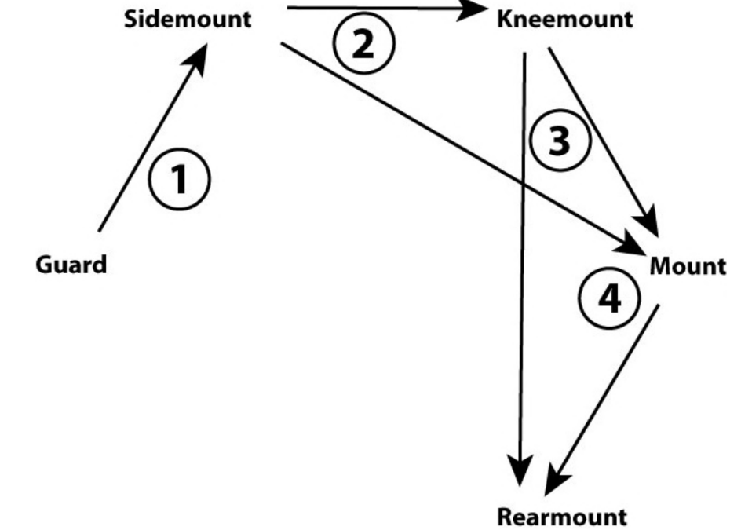
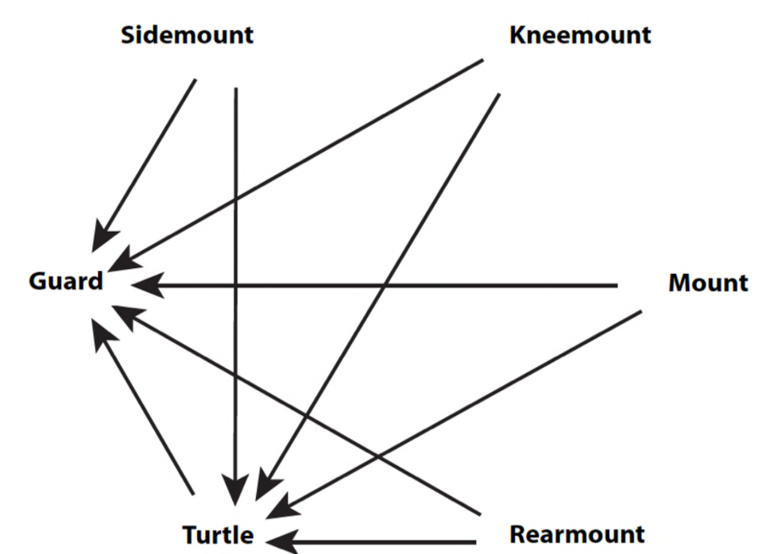

# BJJ roadmap project idea

The idea is to search for material online and create a compilation of techniques that a whitebelt shoud know well in BJJ.

## Techniques & Positions
The techniques could be divide into:
- Warm up drills
- Positions
    - Standing
        - Take down
        - Guard pull
    - Closed guard
        - Passing [attack]
        - Recover [defense]
        - Sweep [defense]
        - Retention [defense]
        - Submmition [attack]
    - Side control
        - Passing [attack]
        - Recover [defense]
        - Sweep [defense]
        - Retention [defense]
        - Submmition [attack]
    - Knee on belly
    - Half guard
        - Passing [attack]
        - Recover [defense]
        - Sweep [defense]
        - Retention [defense]
        - Submmition [attack]
    - Back
        - Passing [attack]
        - Recover [defense]
        - Sweep [defense]
        - Retention [defense]
        - Submmition [attack] 
    - Turtle
        - Passing [attack]
        - Recover [defense]
        - Sweep [defense]
        - Retention [defense]
        - Submmition [attack]

**For every position there are:** 
- Passing [attack]
- Recover [defense]
- Sweep [defense]
- Retention [defense]
- Submmition [attack]

## Positions hierarchy

BEST Rear Mounted on your opponent \
Mounted on your opponent \
Knee Mounted on your opponent \
Side Mounted on your opponent \
Your opponent Turtled beneath you 

NEUTRAL In your opponent’s Guard \
NEUTRAL Opponent in your Guard 

Turtled underneath your opponent \
Side Mounted by your opponent \
Knee Mounted by your opponent \
Mounted by your opponent \
WORST Rear Mounted by your opponent 

Attacking Progression

Defending Progression

